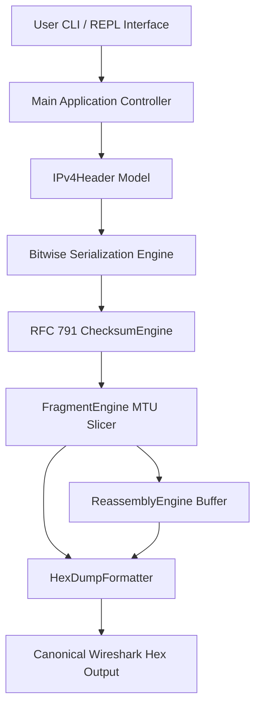
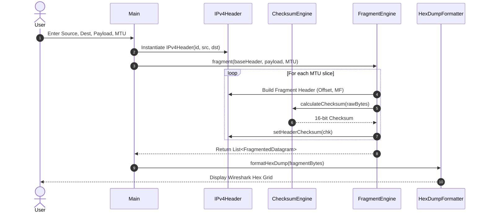

# PacketCraft CLI: System Architecture & Design Specification

## 1. Architectural Overview
PacketCraft CLI models RFC 791 IPv4 datagram encapsulation, bitwise serialization, MTU fragmentation, and one's complement checksum validation. The software follows a modular object-oriented pipeline design where concerns are separated across model, engine, formatting, and presentation layers.



---

## 2. Component Breakdown

### 2.1 Model Layer (`org.packetcraft.model`)
* **`IPv4Header`**: Encapsulates the 20-byte base IPv4 header defined in RFC 791:
  - Version (4 bits) & IHL (4 bits) packed into byte 0.
  - Type of Service / DSCP / ECN (8 bits) at byte 1.
  - Total Length (16 bits) at bytes 2-3.
  - Identification (16 bits) at bytes 4-5.
  - Flags (3 bits: Reserved, DF, MF) and Fragment Offset (13 bits) packed into bytes 6-7.
  - Time to Live (8 bits) at byte 8.
  - Protocol (8 bits) at byte 9 (e.g. TCP=6, UDP=17).
  - Header Checksum (16 bits) at bytes 10-11.
  - Source IP (32 bits) at bytes 12-15.
  - Destination IP (32 bits) at bytes 16-19.
* **`TransportHeader`**: Abstract Layer 4 base class defining common transport-layer interfaces (source port, destination port, protocol number, serialization contract).
* **`UDPHeader`**: Concrete implementation of `TransportHeader` modeling the 8-byte UDP segment header.

### 2.2 Engine Layer (`org.packetcraft.engine`)
* **`ChecksumEngine`**:
  - Implements the RFC 791 16-bit One's Complement sum over 16-bit word boundaries.
  - Handles odd-byte payloads with left-aligned high-byte padding.
  - Folds 32-bit accumulators down to 16 bits until the upper word is zero.
  - Generates inverted checksum and provides one-pass validation over serialized headers containing embedded checksums (evaluating to zero on valid headers).
* **`FragmentEngine`**:
  - Implements Link-Layer MTU slicing.
  - Enforces the `DF` (Don't Fragment) bit constraint: raises a `FragmentationException` if packet size exceeds MTU while DF=1.
  - Ensures slice payloads align to 8-byte boundary intervals (`(mtu - headerLen) & ~0x07`).
  - Sets the `MF` (More Fragments) bit to `true` for all intermediate fragments and `false` for the terminal fragment.
  - Calculates the 13-bit fragment offset in 8-byte units (`offset / 8`).
  - Synthesizes a new IPv4 header with an independently computed checksum for every fragment.
* **`ReassemblyEngine`**:
  - Reassembles fragmented datagrams back into the original payload buffer.
  - Sorts fragments by their fragment offset.
  - Verifies offset continuity and detects missing or dropped packets (`offsetBytes == expectedOffset`).
  - Validates terminal flag state (`MF == false` on the final fragment).

### 2.3 Formatting Layer (`org.packetcraft.formatting`)
* **`HexDumpFormatter`**: Formats raw byte arrays into standard Wireshark / hexdump canonical tables:
  - 16-byte rows with 4-digit hexadecimal byte offset addresses (`0000`, `0010`, `0020`, ...).
  - 8-byte grouped hex values separated by double spaces.
  - Enclosed ASCII gutter (`|...|`) rendering printable characters (`0x20` to `0x7E`) and substituting non-printable control bytes with `.`.

### 2.4 Exception Layer (`org.packetcraft.exception`)
* **`CorruptPacketException`**: Checked exception thrown when headers underflow minimum length constraints (20 bytes) or fail checksum verification.
* **`FragmentationException`**: Checked exception thrown when the specified MTU cannot fit the minimum header size, when DF is asserted, or when offset limits are violated.

---

## 3. Bit Manipulation & Serialization Specification

### 3.1 Version & IHL Bit Packing
```text
Bit:    0   1   2   3   4   5   6   7
      +---+---+---+---+---+---+---+---+
      |    Version    |      IHL      |
      +---+---+---+---+---+---+---+---+
Formula: raw[0] = (byte) (((version & 0x0F) << 4) | (ihl & 0x0F))
```

### 3.2 Flags & Fragment Offset Bit Packing
```text
Bit:    0   1   2   3   4   5   6   7   8   9  10  11  12  13  14  15
      +---+---+---+---+---+---+---+---+---+---+---+---+---+---+---+---+
      | R |DF |MF |                  Fragment Offset                  |
      +---+---+---+---+---+---+---+---+---+---+---+---+---+---+---+---+
Formula:
  int flagsAndOffset = 0;
  if (reserved) flagsAndOffset |= 0x8000;
  if (dontFrag) flagsAndOffset |= 0x4000;
  if (moreFrag) flagsAndOffset |= 0x2000;
  flagsAndOffset |= (offset & 0x1FFF);
  raw[6] = (byte) ((flagsAndOffset >>> 8) & 0xFF);
  raw[7] = (byte) (flagsAndOffset & 0xFF);
```

### 3.3 RFC 791 One's Complement Checksum Mathematical Flow
```text
Incoming 20-byte Header:
[W0, W1, W2, W3, W4, W5, W6, W7, W8, W9] (Checksum word W5 set to 0x0000)

Step 1: 32-bit Summation
   Sum = W0 + W1 + W2 + ... + W9

Step 2: One's Complement End-Around Carry Folding
   while ((Sum >>> 16) > 0)
       Sum = (Sum & 0xFFFF) + (Sum >>> 16)

Step 3: Bitwise Inversion
   Checksum = (~Sum) & 0xFFFF

Step 4: Embedded Verification
   SumWithChecksum = W0 + W1 + ... + Checksum + ... + W9
   FoldedSum = 0xFFFF
   (~FoldedSum) & 0xFFFF == 0x0000  ==>  VALID
```

---

## 4. Sequence Diagram


