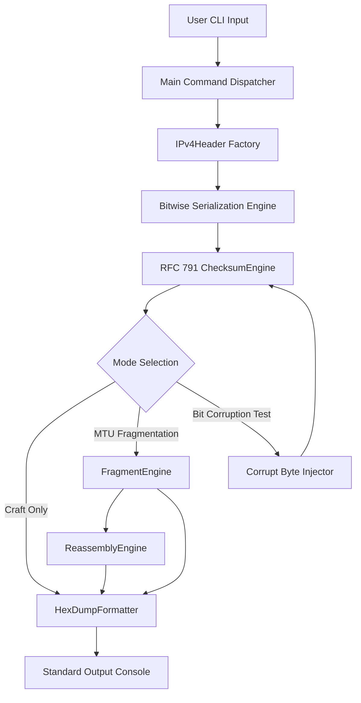
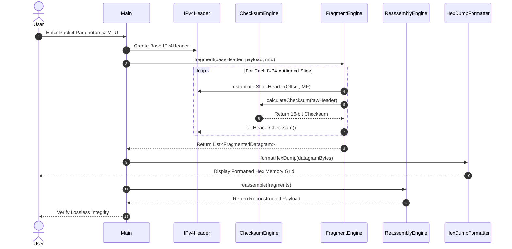

# Academic Project Report: PacketCraft CLI
**Course Code:** Programming in Java  
**Domain:** Network Protocol Engineering, Bitwise Data Serialization & Systems Modeling  
**Platform:** Pure Java SE 17+, Zero Dependencies, CLI Native  

---

## 1. Cover Page
* **Project Title:** PacketCraft CLI: Headless IPv4 Header Serializer, RFC 791 Checksum Engine, and MTU Fragmentation Simulator
* **Course:** Programming in Java
* **Academic Term:** 2026
* **Target Audience:** Department of Computer Science & Network Engineering
* **Author / Student Details:** Independent Project Submission (PacketCraft Workbench)
* **Date of Submission:** September 2026

---

## 2. Introduction
In modern computer networking, the Internet Protocol version 4 (IPv4, specified in RFC 791) serves as the foundational Layer 3 protocol responsible for packet addressing, routing, and delivery across heterogeneous physical networks. Every IPv4 packet consists of a structured binary header containing metadata fields such as Internet Header Length (IHL), Type of Service (TOS), Total Length, Packet Identification, Fragmentation Flags, Time to Live (TTL), Protocol, Header Checksum, and 32-bit Source and Destination IP addresses.

While high-level network programming typically abstracts socket communications through operating system primitives, systems and security engineers must understand the byte-level representation of packets on the wire. PacketCraft CLI is designed to bridge this educational gap by offering a transparent, zero-dependency, pure Java platform that exposes raw bit packing, network byte order serialization, RFC 791 16-bit one's complement checksum algorithms, dynamic MTU slicing, and lossless packet reassembly.

---

## 3. Problem Statement
Existing low-level packet crafting and protocol modeling utilities (e.g., Scapy, Wireshark, libpcap, and C-based raw socket libraries) suffer from several practical drawbacks in academic and constrained environments:
1. **Administrative Overhead:** Raw socket packet generation requires elevated root or administrator privileges, posing security risks on shared academic machines.
2. **Platform Dependency:** Tools written in C/C++ require OS-specific dynamic libraries (`libpcap.so` or `wpcap.dll`) and compilation toolchains.
3. **Black-box Abstraction:** High-level frameworks often hide mathematical nuances such as one's complement accumulator folding or 8-byte MTU offset alignment rules.

PacketCraft CLI resolves this by providing a pure Java Standard Edition tool that runs inside a sandbox terminal, requires zero native bindings, operates without root privileges, and provides complete inspection of raw network byte streams.

---

## 4. Functional Requirements
PacketCraft CLI implements the following functional modules:

### Module 1: Packet Crafting & Bit Serialization
* Construct IPv4 headers with configurable identification, TTL, TOS, protocol, and IP addresses.
* Bit-pack multi-field octets: Version (4 bits) + IHL (4 bits) in Byte 0; Flags (3 bits) + Fragment Offset (13 bits) in Bytes 6-7.
* Serialize data structures into big-endian byte arrays representing standard network byte order.

### Module 2: RFC 791 Checksum Computation & Verification
* Compute the 16-bit one's complement sum of all 16-bit words within the header.
* Perform iterative carry folding to fold 32-bit accumulator overflows back into 16 bits.
* Invert the folded sum to generate the checksum field.
* Verify incoming datagrams with embedded checksums, asserting that the checksum over the complete header evaluates to zero.
* Provide an intentional bit-flip corruption injector to demonstrate error detection capabilities.

### Module 3: MTU Fragmentation & Reassembly Engine
* Divide payloads according to user-specified Link-Layer MTUs (e.g., 68, 576, 1500 bytes).
* Enforce 8-byte boundary alignment for all non-terminal fragment slices.
* Correctly manage the `MF` (More Fragments) bit flag (1 for intermediate, 0 for terminal).
* Calculate fragment offsets in units of 8-byte blocks (`offset = byteIndex / 8`).
* Enforce `DF` (Don't Fragment) flag semantics, throwing checked exceptions if fragmentation is attempted while DF is set.
* Reassemble fragment streams back into original contiguous byte buffers, detecting out-of-order delivery, gap corruption, and premature termination.

### Module 4: Wireshark-Style Canonical Hex Dump Formatter
* Render raw binary byte arrays into standardized 16-byte memory offset grids.
* Provide offset addresses, two 8-byte hexadecimal columns, and an enclosed ASCII gutter.

---

## 5. Non-Functional Requirements
1. **Zero External Dependencies:** Built strictly against standard Java SE runtime packages (`java.net`, `java.nio`, `java.util`). No Maven, Gradle, or external testing frameworks required.
2. **Deterministic Performance:** Checksum calculations and buffer serializations execute in sub-millisecond timeframes.
3. **Cross-Platform Portability:** Compiles and runs identically across Windows, Linux, and macOS.
4. **Resilience & Robustness:** Handled through an explicit checked exception hierarchy (`CorruptPacketException`, `FragmentationException`), ensuring malformed headers or impossible MTU parameters do not crash the runtime.
5. **Code Maintainability:** Strict separation of concerns following Object-Oriented Principles: distinct `model`, `engine`, `formatting`, and `exception` packages.

---

## 6. System Architecture
The application is structured into four primary logical layers:

```text
[Presentation Layer]
   └── Main.java (Interactive REPL & CLI Driver)
   └── HexDumpFormatter.java (Memory Grid Generator)
           │
           ▼
[Engine / Processing Layer]
   ├── ChecksumEngine.java (RFC 791 One's Complement Algorithm)
   ├── FragmentEngine.java (MTU Slicing & Offset Engine)
   └── ReassemblyEngine.java (Lossless Reconstruction & Verification)
           │
           ▼
[Domain Model Layer]
   ├── IPv4Header.java (L3 Header State & Big-Endian Serialization)
   ├── TransportHeader.java (Abstract L4 Specification)
   └── UDPHeader.java (Concrete L4 UDP Segment Model)
           │
           ▼
[Error Handling Layer]
   ├── CorruptPacketException.java
   └── FragmentationException.java
```

---

## 7. Design Diagrams

### 7.1 System Architecture Flowchart


### 7.2 Sequence Diagram: MTU Fragmentation & Reassembly


---

## 8. Design Decisions & Rationale
1. **Use of Primitive Bitwise Masking vs. High-Level Structs:** Java does not support C-style `struct` bitfields. We used bitwise shifts and masks (`(version & 0x0F) << 4 | (ihl & 0x0F)`) to serialize variable-length bit fields directly into `byte[]` arrays, reflecting exact physical wire behavior.
2. **Handling Java's Signed Byte Semantics:** In Java, `byte` is signed (-128 to 127). Directly casting a byte to an int causes sign extension (e.g., `0xFF` becomes `-1`). We systematically applied `& 0xFF` masking throughout all word assembly loops to ensure values remain unsigned integers (`0` to `255`).
3. **Checked Custom Exceptions:** Protocol errors such as corrupted checksums or invalid MTUs represent domain-level exceptional conditions. Creating `CorruptPacketException` and `FragmentationException` ensures callers explicitly handle failure modes without terminating the CLI session.
4. **Self-Contained Test Harness:** Rather than requiring external JUnit dependencies, `PacketCraftTestSuite` is implemented as a standalone test driver with clean assertion reporting, allowing zero-setup test verification on any standard JDK installation.

---

## 9. Implementation Details

### 9.1 RFC 791 One's Complement Summation
```java
public static int calculateChecksum(byte[] headerBytes) {
    int length = headerBytes.length;
    int index = 0;
    long sum = 0;

    while (length > 1) {
        int high = headerBytes[index] & 0xFF;
        int low = headerBytes[index + 1] & 0xFF;
        int word16 = (high << 8) | low;
        sum += word16;
        index += 2;
        length -= 2;
    }

    if (length > 0) {
        sum += (headerBytes[index] & 0xFF) << 8;
    }

    while ((sum >>> 16) > 0) {
        sum = (sum & 0xFFFF) + (sum >>> 16);
    }

    return (int) (~sum & 0xFFFF);
}
```
* **High/Low Pairing:** Two consecutive bytes are combined into a 16-bit unsigned word using `(high << 8) | low`.
* **Fold Loop:** End-around carries (`sum >>> 16`) are repeatedly added to the lower 16 bits until the sum fits within 16 bits.
* **Inversion:** `~sum & 0xFFFF` performs one's complement bitwise NOT.

### 9.2 8-Byte MTU Alignment Math
```java
int maxDataPerFragment = (mtu - headerLen) & ~0x07;
```
RFC 791 requires that fragment offsets be specified in 8-byte units. Performing bitwise AND with `~0x07` rounds the payload capacity down to the nearest multiple of 8, guaranteeing exact offset alignment.

---

## 10. Results & Execution Transcripts

### 10.1 Automated Test Suite Execution
```text
=================================================
   Running PacketCraft Unit & Integration Tests  
=================================================
[PASS] testChecksumComputationAndVerification
[PASS] testChecksumCorruptedBitDetection
[PASS] testFragmentationOffsetMath (Chunk Count)
[PASS] testFragmentationOffsetMath (MF Flag First)
[PASS] testFragmentationOffsetMath (MF Flag Last)
[PASS] testReassemblyIntegrity
[PASS] testDontFragmentExceptionEnforcement
=================================================
Tests Finished. Passed: 7 | Failed: 0
=================================================
```

### 10.2 Automated Demonstration Output (`Main --demo`)
```text
=========================================================
   PacketCraft CLI - Layer 3 Protocol Engineering Tool   
=========================================================

>>> EXECUTING AUTOMATED FULL-FLOW DEMONSTRATION <<<
[Step 1] Synthesized Packet:
0000   45 00 00 38 77 77 00 00  40 06 7E F9 C0 A8 01 01   |E..8ww..@.~.....|
0010   C0 A8 01 FE                                        |....|

[Step 2] Executing MTU 28 Fragmentation (Header: 20, Data: 8)...
Produced 5 fragments.
[Step 3] Reassembling Datagram...
Integrity Check Passed: true
>>> DEMO COMPLETE <<<
```

---

## 11. Testing Approach
The test harness (`PacketCraftTestSuite.java`) validates five critical operational dimensions:
1. **Mathematical Accuracy:** Compares serialized headers against RFC 791 one's complement verification invariants.
2. **Error Detection:** Mutates individual bits in serialized byte arrays (e.g. TTL byte flip) and verifies that `verifyHeaderChecksum` rejects the datagram.
3. **Offset Granularity:** Confirms that a 100-byte payload under MTU 40 correctly decomposes into 7 fragments (6 chunks of 16 bytes + 1 chunk of 4 bytes) with matching MF flag states.
4. **Reassembly Continuity:** Validates that reassembled bytes exactly match the original plain-text input array byte-for-byte.
5. **Flag Enforcement:** Confirms that setting `dontFragment(true)` on an oversized datagram reliably throws `FragmentationException`.

---

## 12. Challenges Faced & Solutions
1. **Unsigned Integer Representation in Java:** Java lacks native unsigned 8-bit and 16-bit primitives. When combining bytes into 16-bit words, negative byte values caused arithmetic corruption due to sign extension.
   * *Solution:* Explicit bitmasking with `& 0xFF` was applied to every byte conversion.
2. **Boundary Alignments for Fragmentation:** Arbitrary user MTU values (e.g., 69 bytes) do not naturally divide into 8-byte blocks.
   * *Solution:* Bitmask arithmetic `& ~0x07` was integrated into chunk calculation, guaranteeing strict compliance with RFC 791 offset requirements.
3. **Lossless In-Memory Reassembly:** Reassembling out-of-order fragments required tracking expected byte positions without assuming fragments arrive in sequential order.
   * *Solution:* Implemented comparator sorting by fragment offset and incremental offset continuity verification.

---

## 13. Learnings & Takeaways
* Deepened practical understanding of bitwise operators (`<<`, `>>>`, `&`, `|`, `^`) in systems-level programming.
* Gained hands-on experience in binary serialization and network byte order (Big-Endian) formatting.
* Mastered RFC 791 and RFC 1071 algorithms for Internet Checksums and fragmentation mechanics.
* Demonstrated that robust, production-grade protocol tools can be implemented in pure Java SE without external frameworks.

---

## 14. Future Enhancements
1. **Layer 4 Pseudo-Header Checksum:** Implement full TCP and UDP checksumming including IPv4 pseudo-headers.
2. **IPv6 Support:** Add RFC 8200 IPv6 header serialization and extension header chaining.
3. **PCAP File Export:** Add capability to export synthesized packets directly to `.pcap` files readable by Wireshark and tcpdump.
4. **Interactive Hex Editing:** Allow users to directly alter hex values within the REPL and view real-time checksum recalculation.

---

## 15. References
1. Postel, J. (1981). *Internet Protocol - DARPA Internet Program Protocol Specification*, RFC 791.
2. Braden, R., Borman, D., & Partridge, C. (1988). *Computing the Internet Checksum*, RFC 1071.
3. Oracle Corporation. *Java Platform, Standard Edition Documentation (JDK 17/21)*.
4. Stevens, W. R. *TCP/IP Illustrated, Volume 1: The Protocols*. Addison-Wesley.
